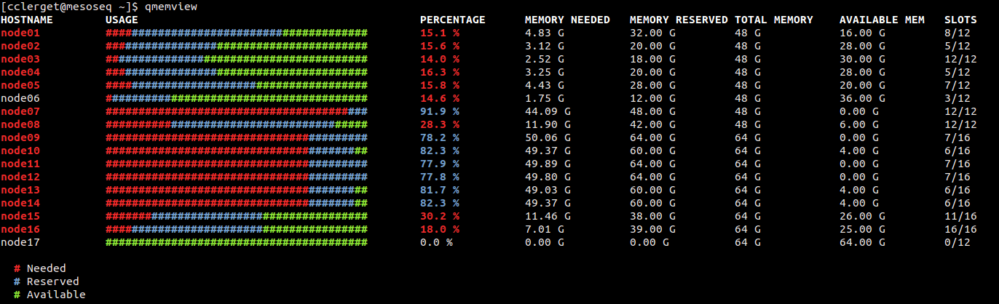

===========
 QmemTools
===========
| QmemTools is a set of tools to monitor memory usage in an SGE cluster.
| 
| It will include more tools in the future but you can develop you own client
| tools to fit your needs. Details about data structure returned in JSON by the
| server are described below
|
| **Note:** QmemTools has been tested on ubuntu, centos and redhat distributions.
| QmemTools is compatible with POSIX system. Windows is not supported.

How it works
============
| A daemon (qmemserver) generate and parse cached xml data from qhost and qstat
| xml output command.
| A client (ie: qmemview.py) request the server to receive JSON structured data
| (refer to Data structure) and do something useful with it.

Dependencies
============
QmemTools requires following packages:

 - python (>=2.4 and <3.0)
 - web.py (>=0.34)
 - simplejson (>=2.0.9)
 - libxml2

Installation
============
 **sudo python setup.py install**

| After installation, a file is create in /etc/init.d/qmemserver, so if
| you want to enable qmemserver at boot time you have to configure manually
| according to your distribution.

Configuration
=============
| The server configuration is locate in **/etc/qmem/qmemserver.conf** and contain two
| sections, files and system which are described.

Server
======
| **qmemserver.py** handle requests and return JSON data as response.
| Qmemserver accept the following url requests:

 - http://localhost:8080/qhost for qhost data
 - http://localhost:8080/qstat for qstat data

The JSON format for a successful request is::

    {"success" : true, "message" : "", "data" : {json_data}}

The JSON format for a failed request is::

    {"success" : false, "message" : "an_error_message", "data" : {}}

Tools
=====
**qmemview.py:** display information about memory usage on your cluster

**qmemview.py** has the following options::

    qmemview.py <url:port> : display all hosts
    qmemview.py <url:port> -h : display this help
    qmemview.py <url:port> -u : display all job details / host
    qmemview.py <url:port> -j <jobid>: display details for one job (set -u automatically)
    qmemview.py <url:port> -o <owner>: display owner's job details (set -u automatically)
    qmemview.py <url:port> -h <hostname> : display only selected host
    qmemview.py <url:port> -u -h <hostname> : display only selected host with job details for this host
    qmemview.py <url:port> -h <hostname> -j <jobid> : display only selected host with job details for jobid only
    <url:port> argument should be set to point on qmemserver address and port. ie: qmemview.py localhost:8080

Data structure
==============

**Returned by qhost**::

    qhost_data[hostname]['num_proc']:str
                        ['mem_total']:str
                        ['jobs'][jobid]['jobcount']:int
                                       ['master']:bool
                                       ['taskid']:list
                                       ['owner']:str
                                       ['jobname']:str

- qhost_data[hostname]['num_proc']
    number of processors on hostname
- qhost_data[hostname]['mem_total']
    total memory available on hostname
- qhost_data[hostname]['jobs']
    contain jobid running on hostname
- qhost_data[hostname]['jobs'][jobid]['jobcount']
    slots used by this job on hostname (don't rely on it for array task, use taskid list length instead)
- qhost_data[hostname]['jobs'][jobid]['master']
    is master run on hostname ?
- qhost_data[hostname]['jobs'][jobid]['taskid']
    list of taskid running on hostname
- qhost_data[hostname]['jobs'][jobid]['owner']
    owner of jobid
- qhost_data[hostname]['jobs'][jobid]['jobname']
    job name

**Returned by qstat**::

    qstat_data[owner]['uid']:str
                     ['jobs'][jobid]['requested_h_vmem_strval']:str
                                    ['requested_h_vmem_dblval']:float
                                    ['hostname'][hostname]['master']:str
                                                          ['slave']:str
                                                          [taskid]:str

- qstat_data[owner]['uid']
    userid of owner
- qstat_data[owner]['jobs'][jobid]['requested_h_vmem_strval']
    requested h_vmem (string format) for owner's jobid
- qstat_data[owner]['jobs'][jobid]['requested_h_vmem_dblval']
    requested h_vmem (double format) for owner's jobid
- qstat_data[owner]['jobs'][jobid]['hostname']
    hostnames where jobid run
- qstat_data[owner]['jobs'][jobid]['hostname'][hostname]['master']
    memory consummed by jobid master on hostname
- qstat_data[owner]['jobs'][jobid]['hostname'][hostname]['slave']
    memory consummed by jobid slave on hostname
- qstat_data[owner]['jobs'][jobid]['hostname'][hostname][taskid]
    memory consummed by jobid task on hostname
